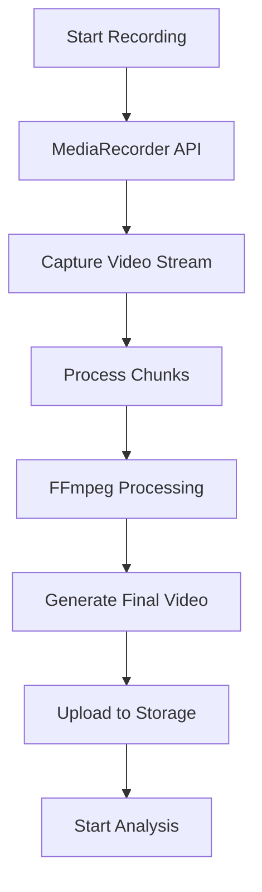
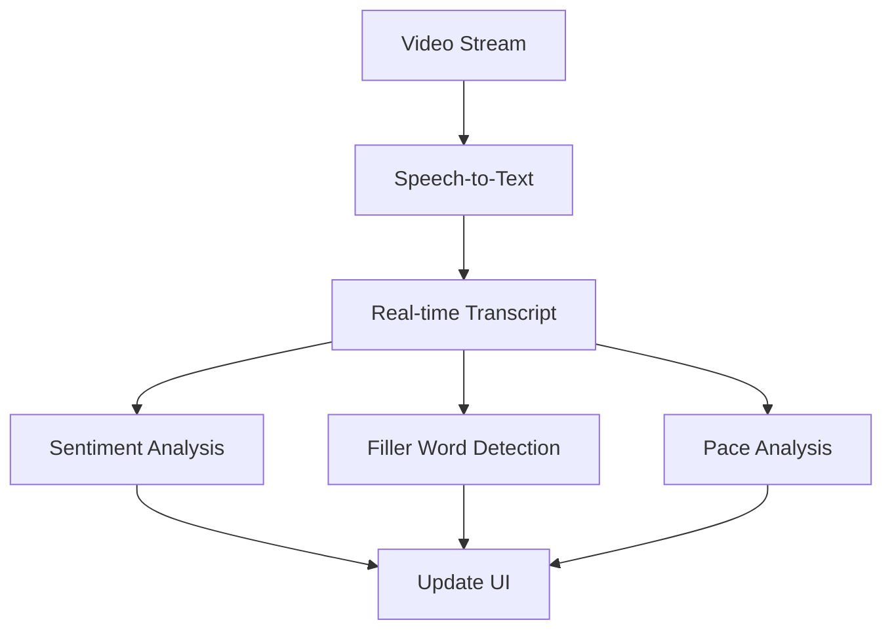

# Frontend System Design - AI Video Interview Platform

## 1. Architecture Overview

### Tech Stack
```
- Framework: Next.js 14 (App Router)
- Language: TypeScript
- State Management: 
  - Zustand (global state)
  - React Query (server state)
  - React Context (theme/auth)
- Styling: Tailwind CSS + shadcn/ui
- Video Processing: Media Recorder API + FFmpeg.wasm
- Real-time: WebSocket/Socket.io
- Testing: Jest + React Testing Library
- Build Tools: Webpack/Vite
```

### Project Structure
```
src/
├── app/                    # Next.js App Router pages
│   ├── layout.tsx
│   ├── page.tsx
│   ├── interview/
│   │   ├── practice/
│   │   ├── analysis/
│   │   └── history/
│   └── settings/
├── components/            # Reusable components
│   ├── ui/               # Basic UI components
│   ├── video/            # Video-related components
│   ├── analysis/         # Analysis components
│   └── shared/           # Shared components
├── hooks/                # Custom hooks
├── store/                # State management
├── services/             # API services
├── types/                # TypeScript types
└── utils/                # Utility functions
```

## 2. Component Architecture

### Core Components Hierarchy
```
<AppLayout>
│
├── <Navbar>
│   ├── <UserProfile>
│   └── <Navigation>
│
├── <InterviewSession>
│   ├── <VideoRecorder>
│   │   ├── <RecordControls>
│   │   └── <VideoPreview>
│   │
│   ├── <RealTimeAnalysis>
│   │   ├── <Transcription>
│   │   ├── <MetricsDisplay>
│   │   └── <FeedbackPanel>
│   │
│   └── <AnalysisDashboard>
│       ├── <PerformanceMetrics>
│       ├── <WordAnalysis>
│       └── <Suggestions>
│
└── <Footer>
```

### Key Component Specifications

#### VideoRecorder Component
```typescript
interface VideoRecorderProps {
  onRecordingComplete: (blob: Blob) => void;
  quality: 'high' | 'medium' | 'low';
  maxDuration?: number;
}

interface VideoRecorderState {
  isRecording: boolean;
  duration: number;
  stream: MediaStream | null;
  error: Error | null;
}
```

#### AnalysisDashboard Component
```typescript
interface AnalysisMetrics {
  confidence: number;
  clarity: number;
  pace: number;
  fillerWords: string[];
  keyPhrases: string[];
  sentiment: {
    positive: number;
    neutral: number;
    negative: number;
  };
}

interface AnalysisDashboardProps {
  videoId: string;
  metrics: AnalysisMetrics;
  transcript: TranscriptSegment[];
  suggestions: Suggestion[];
}
```

## 3. State Management

### Global State (Zustand)
```typescript
interface AppState {
  // User State
  user: User | null;
  session: Session | null;
  
  // Interview State
  currentInterview: {
    id: string;
    status: 'idle' | 'recording' | 'analyzing' | 'complete';
    duration: number;
    timestamp: Date;
  };
  
  // Analysis State
  analysisResults: AnalysisResults | null;
  
  // Actions
  startRecording: () => void;
  stopRecording: () => void;
  saveAnalysis: (results: AnalysisResults) => void;
  resetSession: () => void;
}

const useStore = create<AppState>((set) => ({
  // Initial state and actions
}));
```

### API State Management (React Query)
```typescript
// Custom hooks for API state
const useInterviewHistory = (userId: string) => {
  return useQuery(['interviews', userId], () => 
    fetchInterviewHistory(userId)
  );
};

const useAnalysisResults = (interviewId: string) => {
  return useQuery(['analysis', interviewId], () =>
    fetchAnalysisResults(interviewId)
  );
};
```

## 4. Data Flow

### Video Processing Flow


### Real-time Analysis Flow


## 5. API Integration

### API Service Structure
```typescript
// Base API client
const api = createAPIClient({
  baseURL: process.env.NEXT_PUBLIC_API_URL,
  timeout: 30000,
});

// Interview API services
export const interviewService = {
  create: async (data: InterviewData) => {
    return api.post('/interviews', data);
  },
  
  getAnalysis: async (id: string) => {
    return api.get(`/interviews/${id}/analysis`);
  },
  
  updateFeedback: async (id: string, feedback: Feedback) => {
    return api.patch(`/interviews/${id}/feedback`, feedback);
  }
};
```

## 6. Performance Optimization

### Video Processing Optimization
```typescript
const optimizeVideo = async (blob: Blob): Promise<Blob> => {
  const ffmpeg = createFFmpeg({ log: true });
  await ffmpeg.load();
  
  // Optimize video settings
  const config = {
    width: 1280,
    height: 720,
    bitrate: '1M',
    fps: 30
  };
  
  return processVideo(blob, config);
};
```

### Lazy Loading Strategy
```typescript
// Lazy load components
const VideoPlayer = dynamic(() => import('@/components/video/Player'), {
  loading: () => <VideoPlayerSkeleton />,
  ssr: false
});

const AnalyticsDashboard = dynamic(
  () => import('@/components/analysis/Dashboard'),
  { loading: () => <DashboardSkeleton /> }
);
```

## 7. Error Handling

### Error Boundary Component
```typescript
class ErrorBoundary extends React.Component<Props, State> {
  static getDerivedStateFromError(error: Error) {
    return { hasError: true, error };
  }

  render() {
    if (this.state.hasError) {
      return <ErrorFallback error={this.state.error} />;
    }
    return this.props.children;
  }
}
```

### API Error Handling
```typescript
const handleAPIError = (error: APIError) => {
  switch (error.code) {
    case 'RECORDING_FAILED':
      return {
        title: 'Recording Failed',
        message: 'Please check your camera permissions'
      };
    case 'ANALYSIS_FAILED':
      return {
        title: 'Analysis Error',
        message: 'Unable to process video'
      };
    default:
      return {
        title: 'Error',
        message: 'An unexpected error occurred'
      };
  }
};
```

## 8. Responsive Design Strategy

### Breakpoint System
```typescript
const breakpoints = {
  sm: '640px',
  md: '768px',
  lg: '1024px',
  xl: '1280px',
  '2xl': '1536px'
};

// Tailwind classes
const containerClasses = {
  base: 'w-full mx-auto px-4',
  sm: 'max-w-screen-sm',
  md: 'max-w-screen-md',
  lg: 'max-w-screen-lg',
  xl: 'max-w-screen-xl'
};
```

## 9. Testing Strategy

### Component Testing
```typescript
describe('VideoRecorder', () => {
  it('should start recording when button is clicked', () => {
    render(<VideoRecorder />);
    const button = screen.getByRole('button', { name: /start/i });
    fireEvent.click(button);
    expect(screen.getByText(/recording/i)).toBeInTheDocument();
  });
});
```

### Integration Testing
```typescript
describe('Interview Session', () => {
  it('should complete full interview flow', async () => {
    render(<InterviewSession />);
    // Test complete flow from start to analysis
  });
});
```

## 10. Deployment Configuration

### Next.js Configuration
```typescript
// next.config.js
module.exports = {
  images: {
    domains: ['storage.googleapis.com'],
  },
  webpack: (config) => {
    config.module.rules.push({
      test: /\.worker\.js$/,
      loader: 'worker-loader',
    });
    return config;
  },
};
```


# AI Video Interview Platform Development Roadmap

## 1. System Architecture

### Frontend Architecture
- **Framework**: React with Next.js
- **State Management**: 
  - React Context for app-wide state
  - React Query for API data management
- **UI Components**: 
  - Tailwind CSS for styling
  - shadcn/ui for component library
  - Custom components for specific features
- **Video Processing**:
  - Media Recorder API for video capture
  - WebRTC for real-time processing
  - FFmpeg.wasm for client-side video processing

### Backend Architecture
- **API Layer**: 
  - Node.js with Express/NestJS
  - RESTful API endpoints
  - WebSocket for real-time features
- **Authentication**: 
  - JWT-based auth system
  - OAuth integration for social logins
- **Database**: 
  - PostgreSQL for structured data
  - MongoDB for unstructured data (transcripts, analysis)
- **File Storage**: 
  - Amazon S3/Google Cloud Storage for video files
  - Redis for caching

### AI/ML Services
- **Speech Recognition**: 
  - Whisper API for transcription
  - Custom STT service integration
- **Natural Language Processing**:
  - GPT-4 API for analysis and feedback
  - Custom NLP models for specific metrics
- **Video Analysis**:
  - Computer Vision APIs for body language analysis
  - Emotion detection services

## 2. Development Phases

### Phase 1: MVP Foundation (6-8 weeks)
1. **Basic Platform Setup** (Week 1-2)
   - Set up project structure
   - Configure development environment
   - Implement basic auth system
   - Create basic UI layout

2. **Core Video Features** (Week 3-4)
   - Video recording functionality
   - Basic video playback
   - Video upload/storage
   - Simple video compression

3. **Basic Analysis Features** (Week 5-6)
   - Speech-to-text integration
   - Basic text analysis
   - Simple feedback generation
   - Initial dashboard implementation

4. **MVP Testing & Deployment** (Week 7-8)
   - User testing
   - Bug fixes
   - Initial deployment
   - Performance optimization

### Phase 2: Enhanced Features (8-10 weeks)
1. **Advanced Analysis** (Week 1-3)
   - Sentiment analysis
   - Filler word detection
   - Speech pace analysis
   - Body language analysis

2. **Real-time Features** (Week 4-5)
   - Live transcription
   - Real-time feedback
   - Progress indicators
   - Live metrics

3. **Enhanced Dashboard** (Week 6-7)
   - Advanced analytics
   - Detailed reports
   - Progress tracking
   - Comparison metrics

4. **User Experience** (Week 8-10)
   - Practice sessions
   - Customizable scenarios
   - Interview templates
   - Feedback history

### Phase 3: Advanced Features (10-12 weeks)
1. **AI Enhancements** (Week 1-3)
   - Custom AI models
   - Personalized feedback
   - Advanced speech analysis
   - Behavioral analysis

2. **Collaboration Features** (Week 4-6)
   - Peer review system
   - Expert feedback integration
   - Community features
   - Sharing capabilities

3. **Enterprise Features** (Week 7-9)
   - Team management
   - Custom branding
   - Advanced analytics
   - Integration APIs

4. **Platform Scaling** (Week 10-12)
   - Performance optimization
   - Infrastructure scaling
   - Security enhancements
   - Compliance features

## 3. Technical Implementation Details

### Frontend Implementation
```javascript
// Project structure
src/
  ├── components/
  │   ├── video/
  │   │   ├── VideoRecorder.tsx
  │   │   ├── VideoPlayer.tsx
  │   │   └── VideoControls.tsx
  │   ├── analysis/
  │   │   ├── TranscriptView.tsx
  │   │   ├── AnalyticsDashboard.tsx
  │   │   └── FeedbackPanel.tsx
  │   └── common/
  ├── hooks/
  │   ├── useVideoRecording.ts
  │   ├── useTranscription.ts
  │   └── useAnalytics.ts
  ├── services/
  │   ├── api.ts
  │   ├── analytics.ts
  │   └── storage.ts
  └── utils/
```

### Backend Implementation
```javascript
// API structure
src/
  ├── controllers/
  │   ├── video.controller.ts
  │   ├── analysis.controller.ts
  │   └── user.controller.ts
  ├── services/
  │   ├── transcription.service.ts
  │   ├── analytics.service.ts
  │   └── storage.service.ts
  ├── models/
  └── middleware/
```

## 4. Key Technical Challenges

### Video Processing
- Efficient video compression
- Real-time processing
- Smooth playback
- Storage optimization

### AI Integration
- Real-time analysis
- Model accuracy
- Processing speed
- Resource optimization

### Scalability
- Handle multiple concurrent users
- Process videos efficiently
- Manage storage growth
- Maintain performance

## 5. Testing Strategy

### Unit Testing
- Component testing
- Service testing
- API testing
- Utils testing

### Integration Testing
- API integration
- Service integration
- Frontend-backend integration
- Third-party service integration

### Performance Testing
- Load testing
- Stress testing
- Video processing performance
- AI processing performance

## 6. Monitoring and Analytics

### System Monitoring
- Server performance
- API performance
- Error tracking
- Usage metrics

### User Analytics
- Usage patterns
- Feature adoption
- User engagement
- Performance metrics

## 7. Security Considerations

### Data Security
- Video encryption
- Secure storage
- Access control
- Privacy compliance

### User Security
- Authentication
- Authorization
- Session management
- Data protection

## 8. Deployment Strategy

### Infrastructure
- Cloud provider selection
- Container orchestration
- CDN setup
- Database clustering

### CI/CD
- Automated testing
- Deployment automation
- Version control
- Environment management